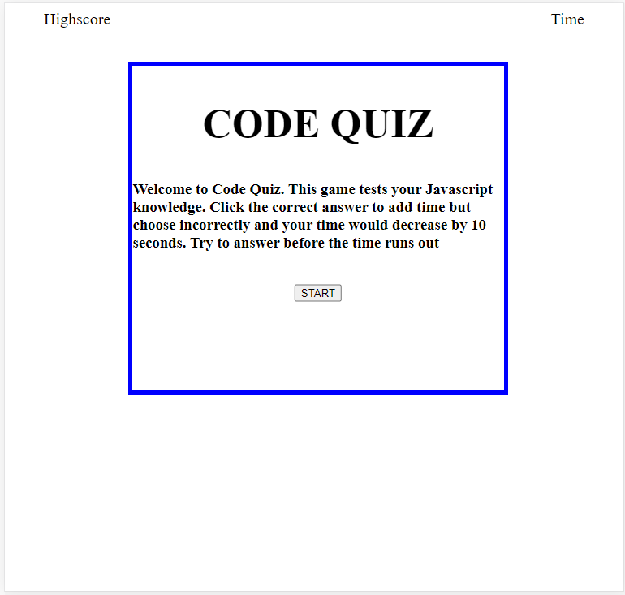
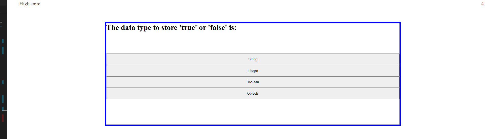

# Code_Quiz

# Random_Password_Generator

[Link to site](https://ericchen96.github.io/Code_Quiz/)  
[Link to Github repository](https://github.com/EricChen96/Code_Quiz)

## Installation

Go to Github and download

## Description

The following code quiz would test the user's JS knowledge. It'll start a timer and loop through a few questions. If the user answers correctly, it adds time and if user answers incorrectly, it'll deduct time. Then it'll display their score at the end and give them a chance to save the score to local computer. 

The timer is located in the top right and the highscores tab is located in top left.
Clicking the highscores during a quiz would immediately stop the game to load the highscores.

In the highscores page, user can select to reset the highscores list. A maximum of 10 entries may be recorded and any new highscore entry would pop the first highscore out and push in the new highscore. 

